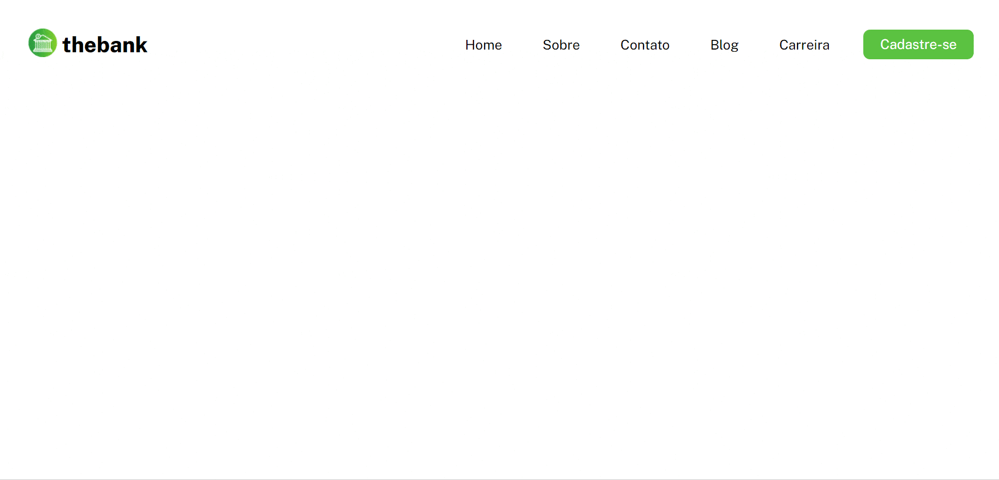
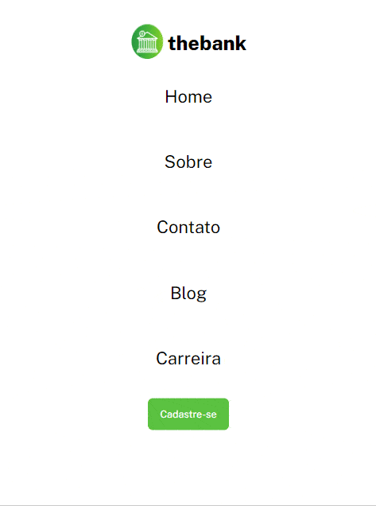
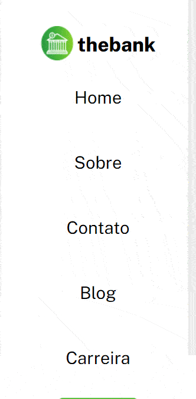

# Exercicio @Devquest - Menu Flexbox


#### Exemplo de  Menu utilizando flexbox com elementos interativos com uso do hover

## Índice

- [Capturas de telas](#capturas-de-telas)
- [Links](#links)
- [Construído com](#construído-com)
- [O que aprendi](#o-que-aprendi)
- [Desenvolvimento contínuo](#desenvolvimento-contínuo)
- [Recursos úteis](#recursos-úteis)
- [Luis Fernando Guimaraes](#autor)

### Capturas de telas

#### Tela Desktop



#### Tela Ipad



#### Tela Mobile



### Links

- Site URL: https://luis92guimaraes.github.io/menu-flexbox/

### Construído com

<div style="display: inline_block"><br>
  
       
</div>

### O que aprendi

Esse exercicio foi proposto dentro do curso devquest da @Devemdobro, exercicio do modulo avançado de CSS. É um exemplo de Menu de um site, foi usado conceitos de flexbox e o uso do hover para a criação.

## Trechos de códigos

```
.menu li a:hover{
    background-color: var(--btn-hover-color);
    color: var(--btn-text-color);
}

.button {
    display: flex;
    justify-content: center;
    align-items: center;
    background-color: var(--btn-hover-color);
    color: var(--btn-text-color);
    padding: 10px 25px;
    border-radius: 10px;
    font-size: 20px;
}

.button:hover {
    transform: scale(1.1);
    transition: 0.1 ease-in-out;
    color: var(--btn-text-hover-color);
}

```

### Desenvolvimento contínuo

Pretendo continuar aprendendo cada vez mais sobre as ferramentas utilizadas nesse projeto, ainda tem muita coisa pra ser absorvida mas sigo confiante e feliz em estar conseguindo realizar projetos como esse com mais clareza e confiança a cada dia de estudos.

### Recursos úteis

- [Mdn](https://developer.mozilla.org/en-US/) - O Mozilla Developer Network (MDN) desempenha um papel crucial ao fornecer recursos abrangentes e atualizados para desenvolvedores web em todo o mundo.
- [W3School](https://www.w3schools.com/css/default.asp) - Esse site sempre me ajuda a resolver qualquer problema relacionados a códigos de uma maneira fácil e muito rápida.
- [Dev em Dobro](https://www.youtube.com/@DevemDobro) - Este é um canal onde encontro muito material. Tem muito conteúdo relacionado ao desenvolvimento. Recomendo a todos que querem aprender sobre esse e outros conceitos relacionados.

## Autor

[Luis Fernando Guimarães](https://www.linkedin.com/in/luisfguimaraes/)